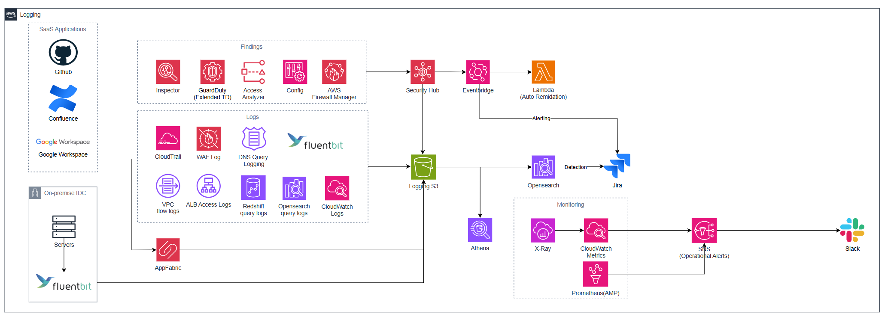

# Enterprise Logging Attachment Module

기존 AWS 운영 환경에 **중앙 로깅, 보안 Findings 수집, SIEM 분석, 운영 알림**을 붙일 수 있는 안전한 아키텍처의 로깅 Terraform 프레임워크입니다.

이 모듈은 VPC, 컴퓨팅, DB, ALB, WAF, Route53 Hosted Zone, SaaS 애플리케이션, 온프레미스 서버를 새로 설계하는 모듈이 아닙니다. 이미 운영 중인 리소스와, 사용자가 선택한 보안/로그 수집 서비스를 조합해 관찰성 레이어를 구성할 수 있도록 기본 골격을 제공합니다.

즉, “서비스는 이미 있는데 어떤 로그를 모을지, 어떤 Finding 소스를 켤지, 어디로 분석/알림을 보낼지 정리하고 싶다”는 상황에서 사용하는 모듈입니다. 모든 기능을 한 번에 켜는 것이 아니라, 운영 환경에 필요한 소스만 선택해서 넣고 뺄 수 있습니다.



---

## 이 모듈의 역할

여러 계정과 서비스에서 발생하는 로그와 보안 이벤트는 보통 서로 다른 위치에 흩어져 있습니다. 이 모듈은 흩어진 이벤트를 중앙 S3 버킷으로 모으고, Security Hub, EventBridge, Lambda, OpenSearch, SNS를 통해 탐지와 알림 흐름을 구성할 수 있는 공통 프레임을 제공합니다.

사용자는 아래 요소를 환경에 맞게 선택합니다.

| 선택 영역 | 예시 | 선택 기준 |
|-----------|------|-----------|
| 로그 소스 | CloudTrail, VPC Flow Logs, WAF Logs, DNS Query Logs | 어떤 활동을 감사/추적해야 하는가 |
| Finding 소스 | GuardDuty, Inspector, Config, Access Analyzer, Security Hub | 어떤 보안 탐지를 계정에서 켤 것인가 |
| 외부 소스 | SaaS AppFabric, 온프레미스 FluentBit | AWS 밖의 감사 로그까지 모을 것인가 |
| 분석 계층 | S3 only, OpenSearch, CloudWatch Alarms, Athena 확장 | 저장만 할지, 검색/탐지까지 할지 |
| 알림/조치 | SNS, Slack, Jira, Auto Remediation | 누가 어떻게 후속 조치할 것인가 |

| 기존 또는 외부 소스 | 이 모듈이 붙이는 경로 | 비고 |
|--------------------|----------------------|------|
| AWS 계정 API 이벤트 | CloudTrail -> CloudWatch Logs/S3 | CloudTrail은 모듈이 생성 |
| VPC | VPC Flow Logs -> S3 | 기존 VPC ID 필요 |
| ALB | ALB Access Logs -> S3 | `alb_arns` 변수는 있으나 현재 코드에는 설정 리소스 추가 필요 |
| WAF WebACL | WAF Logging -> Firehose -> S3 | 기존 WAF WebACL ARN 필요 |
| Route53 Hosted Zone | DNS Query Logs -> CloudWatch Logs | 기존 Hosted Zone ID 필요 |
| GitHub, Confluence, Google Workspace 등 | AppFabric -> S3 | OAuth Secret 필요 |
| 온프레미스 서버 | FluentBit -> Firehose -> S3 | FluentBit 설치/설정 필요 |
| GuardDuty, Inspector, Config, Access Analyzer | Security Hub Findings -> EventBridge | 없으면 모듈이 생성/활성화 가능 |
| CloudWatch/X-Ray/AMP | SNS -> Slack/Jira | 일부는 기본 생성, AMP는 선택 |

핵심 경로는 아래와 같습니다.

```text
기존 로그 소스와 AWS 보안 Findings
        ↓
Central Logging S3
        ↓
OpenSearch / Security Hub / CloudWatch
        ↓
EventBridge / Lambda / SNS
        ↓
Slack / Jira / Auto Remediation
```

---

## 다이어그램 읽는 법

위 그림은 여섯 영역으로 나눠 보면 이해하기 쉽습니다.

| 영역 | 포함 요소 | 설명 |
|------|-----------|------|
| SaaS Applications | GitHub, Confluence, Google Workspace | AppFabric으로 감사 로그를 중앙 S3에 적재 |
| On-premise IDC | Servers, FluentBit | FluentBit이 Firehose로 로그 전송 |
| Findings | Inspector, GuardDuty, Access Analyzer, Config, Firewall Manager | AWS 보안 Findings를 Security Hub로 통합 |
| Logs | CloudTrail, WAF, DNS Query, VPC Flow, ALB, CloudWatch Logs | AWS 로그를 중앙 S3 또는 CloudWatch Logs로 수집 |
| Detection & Alerting | Security Hub, EventBridge, Lambda, OpenSearch, Jira | Findings 라우팅, 자동 조치, 티켓 생성 |
| Monitoring | X-Ray, CloudWatch Metrics, AMP, SNS, Slack | 지표 기반 운영 알림 |

왼쪽은 대부분 **선택 가능한 로그/Finding 소스**이고, 가운데 이후는 이 모듈이 새로 만들거나 연결하는 **수집/분석/알림 레이어**입니다.
다이어그램은 가능한 조합을 보여주는 참조 아키텍처이며, 모든 요소를 반드시 켜야 하는 것은 아닙니다.

---

## 언제 쓰면 좋나요?

이 모듈은 아래와 같은 상태에서 특히 유용합니다.

| 이미 있는 것 | 이 모듈로 해결하는 것 |
|--------------|----------------------|
| VPC, Subnet, EC2/EKS/ECS/Lambda 같은 컴퓨팅 환경 | 네트워크/API/보안 이벤트를 한 곳으로 수집 |
| ALB, WAF, Route53 같은 트래픽 진입 지점 | 차단 로그, DNS Query Log 연결. ALB Access Logs는 현재 코드 확장 필요 |
| RDS, Redshift 등 데이터 서비스 | 현재 모듈에 직접 DB 로그 수집은 없으므로 S3/CloudWatch 경로 추가 커스터마이징 필요 |
| 보안 서비스 구성이 아직 확정되지 않은 AWS 계정 | GuardDuty, Inspector, Access Analyzer, Security Hub 등을 선택적으로 생성/연결 |
| Slack/Jira 같은 운영 도구 | 알림과 티켓 생성 자동화 |
| 로그 저장/검색/탐지 기준이 아직 정리되지 않은 환경 | S3 중심 저장소, OpenSearch, CloudWatch Alarm의 기본 프레임 제공 |

중요한 구분은 다음과 같습니다.

| 구분 | 이 모듈의 동작 |
|------|----------------|
| VPC/WAF/Route53/온프레미스 서버 | 새로 만들지 않고 기존 리소스에 로깅을 연결 |
| ALB | 변수는 있으나 현재 코드에는 Access Log 활성화 리소스가 없음 |
| GuardDuty/Inspector/Access Analyzer/Security Hub | flag가 켜져 있으면 새로 생성 또는 활성화 시도 |
| AWS Config | 현재 코드 기준으로 조건 없이 생성 시도 |
| OpenSearch/OSIS/SNS/CloudWatch/X-Ray | 로깅 분석과 알림을 위해 새로 생성 |
| RDS/Redshift DB 로그 | 현재 코드에는 직접 구현 없음. CloudWatch/S3 export 경로를 추가해야 함 |
| Athena/Firewall Manager | 다이어그램에는 표현되어 있지만 현재 Terraform 생성 리소스는 아님 |

사용자의 환경에 맞게 **운영 환경에 필요한 로깅/Finding/알림 블록을 선택해서 조립**할 수 있습니다.

---

## 어떤 블록을 조립하나요?

아래 표는 현재 `modules/` 코드 기준입니다. 각 블록은 기본값으로 켜져 있거나 입력값이 있을 때 생성됩니다. 필요 없는 블록은 flag를 끄거나 입력값을 비워 제외합니다.

### 기본 블록

| 리소스 | 생성 조건 | 설명 |
|--------|-----------|------|
| Central Logging S3 Bucket | `existing_logging_bucket_id`가 비어 있을 때 | 모든 로그의 중앙 저장소 |
| S3 Versioning/Encryption/Lifecycle/Policy | 새 S3 Bucket 생성 시 | 버전 관리, 암호화, 수명주기, 로그 쓰기 정책 |
| CloudTrail | 항상 생성 | Multi-region Trail, S3/Lambda Data Events, Insights 포함 |
| CloudTrail CloudWatch Log Group/IAM Role | 항상 생성 | CloudTrail 이벤트를 CloudWatch Logs로도 전달 |
| SNS Topic | 항상 생성 | 운영 알림 허브 |
| Alerting Lambda IAM Role/Policy | 항상 생성 | Slack/Jira Lambda용 공통 Role |
| X-Ray Group/Sampling Rule | 항상 생성 | 기본 분산 추적 설정 |
| CloudWatch Metric Filters/Alarms/Dashboard | 항상 생성 | CloudTrail 기반 보안 이벤트 감지 |

### 선택 블록

| 리소스 | 생성 조건 | 설명 |
|--------|-----------|------|
| GuardDuty Detector | `enable_guardduty = true` | S3/Kubernetes/Malware/Runtime Monitoring 포함 |
| GuardDuty S3 Publishing Destination | `enable_guardduty = true` | GuardDuty 결과를 S3 prefix로 export |
| Inspector v2 Enabler | `enable_inspector = true` | EC2, ECR, Lambda, Lambda Code 스캔 |
| Access Analyzer | `enable_access_analyzer = true` | Account scope analyzer 생성 |
| Security Hub Account/Standards | `enable_security_hub = true` | FSBP, CIS 표준 구독 |
| Security Hub EventBridge Rule/SNS Target | `enable_security_hub = true` | HIGH/CRITICAL Findings 라우팅 |
| Auto Remediation Lambda | `enable_auto_remediation = true` | S3 public access block, IAM key 비활성화, SG ingress 제거 등 |
| OpenSearch Domain | `enable_opensearch = true` | VPC 내부 OpenSearch SIEM |
| OSIS Pipeline | `enable_opensearch = true` | S3 로그를 OpenSearch로 인덱싱 |
| OpenSearch Security Group | `enable_opensearch = true`이고 기존 SG 미입력 | VPC CIDR에서 443 허용 |
| OpenSearch Admin Secret/Random Password | `enable_opensearch = true`이고 기존 Secret 미입력 | admin 자격증명 자동 생성 |
| WAF Firehose/Logging Configuration | `waf_acl_arn` 입력 | WAF 로그를 Firehose 경유로 S3 적재 |
| VPC Flow Logs | `vpc_ids` 입력 | VPC별 Flow Logs를 S3 적재 |
| Route53 DNS Query Logs | `route53_zone_ids` 입력 | us-east-1 CloudWatch Log Group 사용 |
| AppFabric App Authorization/Ingestion | `saas_apps` 입력 | SaaS 감사 로그를 OCSF JSON으로 S3 적재 |
| On-prem Firehose | `onprem_sources` 입력 | 소스별 Firehose 생성 |
| FluentBit IAM User/Access Key | `onprem_sources[].existing_iam_role_arn` 미입력 | 온프레미스 인증 정보 자동 생성 |
| FluentBit Secret | `onprem_sources` 입력 | FluentBit output 설정 저장 |
| Slack Lambda/Subscription | `slack_webhook_url` 입력 | SNS 알림을 Slack으로 전달 |
| Jira Lambda/Subscription | `jira_url`과 `jira_api_token_secret_arn` 입력 | HIGH/CRITICAL Findings 티켓 생성 |
| AMP Workspace/Alert Manager | `enable_amp = true` | Prometheus Workspace와 SNS Alert Manager |
| Grafana AMP Role | `enable_amp = true`와 `grafana_workspace_id` 입력 | Grafana에서 AMP 조회 |

### 기존 리소스에 연결하는 블록

| 대상 | 필요한 값 | 모듈이 하는 일 |
|------|-----------|----------------|
| 기존 VPC | `vpc_ids` | VPC Flow Logs를 S3로 보내도록 설정 |
| 기존 ALB | `alb_arns` | 현재 변수만 존재. Access Log 설정 리소스는 추가 구현 필요 |
| 기존 WAF WebACL | `waf_acl_arn` | WAF Logging Configuration과 Firehose 생성 |
| 기존 Route53 Hosted Zone | `route53_zone_ids` | DNS Query Logging 생성 |
| 기존 SaaS Tenant | `saas_apps` | AppFabric Authorization/Ingestion 생성 |
| 기존 온프레미스 서버 | `onprem_sources` | Firehose와 FluentBit 접속 정보 제공 |
| 기존 Logging Bucket | `existing_logging_bucket_id`, `existing_logging_bucket_arn` | 새 S3 Bucket 생성을 건너뛰고 기존 버킷 사용 |
| 기존 OpenSearch Admin Secret | `opensearch_admin_secret_arn` | admin Secret 자동 생성을 건너뜀 |
| 기존 OpenSearch Security Group | `opensearch_security_group_ids` | OpenSearch SG 자동 생성을 건너뜀 |

### 현재 코드에서 주의할 점

`enable_config` 변수는 정의되어 있지만, 현재 `modules/security_findings/main.tf`에서는 AWS Config IAM Role, Configuration Recorder, Delivery Channel, Recorder Status가 조건 없이 생성됩니다. 이미 AWS Config를 별도로 운영 중인 계정에서는 충돌 가능성이 있으므로 적용 전에 import 또는 코드 조정 전략을 정해야 합니다.

Security Hub product subscription 일부도 flag와 완전히 분리되어 있지 않으므로, GuardDuty/Inspector/Security Hub를 모두 끄는 시나리오는 `terraform plan`으로 먼저 검증하는 것을 권장합니다.

`alb_arns` 변수는 정의되어 있지만 현재 `modules/log_sources/main.tf`에는 ALB Access Log를 활성화하는 `aws_lb`/`aws_alb` 관련 리소스가 없습니다. ALB 로그까지 완성하려면 기존 ALB를 Terraform state로 관리하거나 별도 모듈에서 `access_logs` 설정을 추가해야 합니다.

다이어그램의 Athena, Firewall Manager, Redshift query logs는 현재 코드에서 직접 생성/설정되지 않습니다. README 본문에서는 현재 구현된 범위와 확장 대상으로 구분합니다.

---

## 필수 준비물

최소 배포를 하려면 아래 값은 반드시 필요합니다.

| 준비물 | 예시 | 설명 |
|--------|------|------|
| Terraform | `>= 1.5` | 모듈 배포 |
| AWS Provider | `>= 5.0` | AWS 리소스 생성 |
| 배포 IAM Role | `s3:*`, `cloudtrail:*`, `iam:PassRole` 등 | 생성 서비스가 많으므로 PoC에서는 넓게 시작하고 운영 전 최소화 |
| `project` | `platform` | 리소스 이름 prefix |
| `environment` | `dev`, `stg`, `prod` | 배포 환경 |
| 기존 VPC ID | `vpc-0a1b2c3d...` | OpenSearch 배치 |
| 기존 Private Subnet ID | `subnet-0aaa...`, `subnet-0bbb...` | OpenSearch VPC 배치. 2개 이상 권장 |
| `aws.us_east_1` provider alias | `region = "us-east-1"` | Route53 DNS Query Logs용 CloudWatch Log Group에 필요 |

### 원하는 로그별 추가 준비물

| 넣고 싶은 블록 | 먼저 있어야 하는 것 | 모듈 입력값 |
|----------------|--------------------|-------------|
| VPC 트래픽 로그 | 기존 VPC | `vpc_ids` |
| ALB 접근 로그 | 기존 ALB | 현재 추가 구현 필요. `alb_arns` 변수만 존재 |
| WAF 차단/허용 로그 | 기존 WAF WebACL | `waf_acl_arn` |
| DNS Query Log | 기존 Route53 Hosted Zone | `route53_zone_ids` |
| Slack 알림 | Slack Incoming Webhook | `slack_webhook_url`, `slack_channel` |
| Jira 티켓 생성 | Jira URL, API Token Secret | `jira_url`, `jira_api_token_secret_arn` |
| SaaS 감사 로그 | AppFabric 지원 SaaS 앱, OAuth Secret | `saas_apps` |
| 온프레미스 로그 | FluentBit 설치 가능 서버 | `onprem_sources` |
| 기존 로그 버킷 재사용 | S3 Bucket과 쓰기 정책 | `existing_logging_bucket_id`, `existing_logging_bucket_arn` |
| KMS 암호화 | KMS Key와 Key Policy | `kms_key_arn` |

WAF, ALB, Route53는 이 모듈이 새로 만들지 않습니다. 해당 보안/트래픽 리소스가 없다면 먼저 별도 모듈이나 콘솔에서 생성한 뒤 ARN/ID를 넘겨야 합니다.

보안 서비스도 두 종류로 나눠서 보면 편합니다.

| 종류 | 예시 | 이 모듈의 처리 |
|------|------|----------------|
| 워크로드 앞단 보안 리소스 | WAF WebACL | 직접 생성하지 않음. 기존 ARN을 받아 로깅만 연결 |
| 계정/리소스 탐지 서비스 | GuardDuty, Inspector, Access Analyzer, Security Hub | flag가 켜져 있으면 생성 또는 활성화 시도 |

따라서 WAF 로그 블록을 쓰려면 먼저 WAF WebACL이 있어야 합니다. 반면 GuardDuty 같은 계정 보안 서비스는 이 모듈의 Finding 블록으로 켜는 흐름이 가능합니다.

---

## 최소 조합 예시

처음에는 중앙 로깅 S3, CloudTrail, 기본 보안 Findings, OpenSearch SIEM만 붙이는 작은 조합으로 시작할 수 있습니다.

```hcl
provider "aws" {
  region = "ap-northeast-2"
}

provider "aws" {
  alias  = "us_east_1"
  region = "us-east-1"
}

module "logging" {
  source = "./04-scale-enterprise/logging-module"

  providers = {
    aws           = aws
    aws.us_east_1 = aws.us_east_1
  }

  project     = "platform"
  environment = "prod"

  opensearch_vpc_id     = "vpc-0a1b2c3d4e5f67890"
  opensearch_subnet_ids = ["subnet-0aaa1111", "subnet-0bbb2222"]

  tags = {
    Owner       = "security-platform"
    Environment = "prod"
  }
}
```

배포 후 값을 쉽게 확인하려면 root module에 output을 추가합니다.

```hcl
# outputs.tf
output "logging_bucket" {
  value = module.logging.logging_bucket_id
}

output "opensearch_dashboard" {
  value = module.logging.opensearch_dashboard_url
}

output "opensearch_admin_secret_arn" {
  value = module.logging.opensearch_admin_secret_arn
}

output "guardduty_detector_id" {
  value = module.logging.guardduty_detector_id
}

output "sns_topic_arn" {
  value = module.logging.sns_topic_arn
}

output "onprem_fluentbit_configs" {
  value     = module.logging.onprem_fluentbit_configs
  sensitive = true
}
```

배포합니다.

```bash
terraform init
terraform plan
terraform apply
```

---

## 로그 소스 블록 추가하기

최소 적용 후, 기존 리소스의 ARN/ID를 추가하면 해당 로그 수집이 활성화됩니다.

```hcl
module "logging" {
  # 기본 설정 생략

  vpc_ids = [
    "vpc-0a1b2c3d4e5f67890",
  ]

  waf_acl_arn = "arn:aws:wafv2:ap-northeast-2:123456789012:regional/webacl/prod-waf/xxxx"

  route53_zone_ids = [
    "Z1D633PJN98FT9",
  ]
}
```

입력하지 않은 로그 소스는 생성되지 않습니다.
예를 들어 `waf_acl_arn = ""`이면 WAF Logging용 Firehose와 WAF Logging Configuration을 만들지 않습니다.

### 로그 소스별 동작 상세

| 입력 | 생성되는 리소스 | S3/로그 위치 | 주의사항 |
|------|----------------|--------------|----------|
| `vpc_ids` | `aws_flow_log` | `vpc-flow-logs/<vpc-id>/` | VPC 자체는 만들지 않음 |
| `waf_acl_arn` | Firehose, Firehose IAM Role, WAF Logging Configuration | `waf-logs/` | WAF WebACL은 먼저 존재해야 함 |
| `alb_arns` | 현재 생성 리소스 없음 | 없음 | 변수는 있으나 코드 구현 필요 |
| `route53_zone_ids` | us-east-1 CloudWatch Log Group, Resource Policy, Query Log | `/aws/route53/<prefix>` | provider alias `aws.us_east_1` 필요 |
| CloudTrail | CloudTrail, CloudWatch Log Group, IAM Role | `cloudtrail/` | 항상 생성됨 |

ALB 로그가 필요하다면 현재 모듈에 아래 중 하나를 추가해야 합니다.

| 방식 | 설명 |
|------|------|
| 기존 ALB를 Terraform으로 관리 중 | 해당 `aws_lb` 리소스에 `access_logs` 블록 추가 |
| ALB가 외부에서 관리됨 | ALB 관리 모듈에서 access logs 활성화 후 이 모듈의 S3 bucket/prefix 사용 |
| 이 모듈에서 직접 처리하고 싶음 | `modules/log_sources/`에 ALB ARN을 기반으로 access log 설정을 관리하는 구조 추가 |

DB 로그가 필요하다면 현재 모듈만으로는 RDS/Redshift 로그 export가 자동 구성되지 않습니다. RDS Enhanced Monitoring, CloudWatch Logs export, Redshift audit/user/activity log export 등을 별도 활성화한 뒤 S3/OpenSearch 수집 경로를 추가하는 방식으로 확장해야 합니다.

---

## SaaS 감사 로그 블록 추가하기

SaaS 앱은 AppFabric을 통해 중앙 Logging S3로 들어옵니다. Secret에는 `client_id`, `client_secret`이 JSON으로 저장되어 있어야 합니다.

```hcl
module "logging" {
  # 기본 설정 생략

  saas_apps = [
    {
      name                  = "github"
      app_type              = "GITHUB"
      credential_secret_arn = "arn:aws:secretsmanager:ap-northeast-2:123456789012:secret:logging/github-oauth"
      tenant_id             = ""
    },
    {
      name                  = "confluence"
      app_type              = "ATLASSIAN"
      credential_secret_arn = "arn:aws:secretsmanager:ap-northeast-2:123456789012:secret:logging/atlassian-oauth"
      tenant_id             = "example.atlassian.net"
    },
    {
      name                  = "google-workspace"
      app_type              = "GOOGLEWORKSPACE"
      credential_secret_arn = "arn:aws:secretsmanager:ap-northeast-2:123456789012:secret:logging/gws-oauth"
      tenant_id             = "example.com"
    }
  ]
}
```

지원 예시: `GITHUB`, `ATLASSIAN`, `GOOGLEWORKSPACE`, `SALESFORCE`, `SLACK`, `ZOOM`, `DROPBOX`, `BOX`, `ASANA`, `MONDAY`

---

## 온프레미스 로그 블록 추가하기

온프레미스 서버는 FluentBit에서 Kinesis Firehose로 로그를 전송하고, Firehose가 중앙 Logging S3에 적재합니다.

```hcl
module "logging" {
  # 기본 설정 생략

  onprem_sources = [
    {
      name        = "idc-primary"
      description = "Primary IDC server group"
      log_prefix  = "onprem/idc-primary/"
    },
    {
      name                  = "idc-dr"
      description           = "DR IDC server group"
      log_prefix            = "onprem/idc-dr/"
      existing_iam_role_arn = "arn:aws:iam::123456789012:role/existing-fluentbit-role"
    }
  ]
}
```

`existing_iam_role_arn`을 비워두면 모듈이 IAM User와 Access Key를 만들고 Secrets Manager에 FluentBit 설정과 함께 저장합니다. 기존 Role을 입력하면 Access Key를 만들지 않고 Firehose 정보만 Secret에 저장합니다.

```bash
terraform output -json onprem_fluentbit_configs
```

---

## Slack과 Jira 알림 블록 추가하기

Slack은 운영 알림 수신처로, Jira는 보안 이벤트의 후속 조치 티켓으로 사용합니다.

```hcl
module "logging" {
  # 기본 설정 생략

  slack_webhook_url = "https://hooks.slack.com/services/T.../B.../xxx"
  slack_channel     = "#security-alerts"

  jira_url                  = "https://example.atlassian.net"
  jira_api_token_secret_arn = "arn:aws:secretsmanager:ap-northeast-2:123456789012:secret:logging/jira-token"
  jira_project_key          = "SEC"
  jira_issue_type           = "Bug"
}
```

Jira Secret은 아래 형식을 사용합니다.

```json
{
  "email": "security@example.com",
  "api_token": "xxxxxxxx"
}
```

---

## 이미 켜져 있는 보안 서비스 처리

운영 계정에서는 GuardDuty, Inspector, Access Analyzer, Security Hub, AWS Config가 이미 켜져 있을 수 있습니다.

현재 코드 기준으로 아래 flag를 `false`로 두면 일부 보안 서비스 생성을 끌 수 있습니다.

```hcl
module "logging" {
  # 기본 설정 생략

  enable_guardduty        = false
  enable_inspector        = false
  enable_access_analyzer  = false
  enable_security_hub     = false
  enable_auto_remediation = false
}
```

다만 AWS Config 리소스는 현재 코드에서 `enable_config`와 무관하게 생성됩니다. 이미 AWS Config를 운영 중이라면 아래 중 하나를 먼저 선택하는 것이 좋습니다.

| 선택지 | 설명 |
|--------|------|
| Terraform import | 기존 Config Recorder/Delivery Channel을 이 모듈 state로 편입 |
| 코드 조정 | Config 관련 리소스에 `count = var.enable_config ? 1 : 0` 패턴 추가 |
| 별도 배포 계정 사용 | 기존 Config와 충돌하지 않는 계정에서 먼저 검증 |

---

## 기존 중앙 로그 버킷 재사용

이미 중앙 로그 버킷이 있다면 새 S3 Bucket을 만들지 않고 기존 버킷을 사용할 수 있습니다.

```hcl
module "logging" {
  # 기본 설정 생략

  existing_logging_bucket_id  = "central-logging-prod"
  existing_logging_bucket_arn = "arn:aws:s3:::central-logging-prod"
}
```

이 경우 기존 버킷 정책이 CloudTrail, GuardDuty, AWS Config, Firehose, AppFabric, VPC Flow Logs, ALB Access Logs 쓰기를 허용해야 합니다. KMS를 쓰는 버킷이라면 Key Policy도 함께 확인해야 합니다.

---

## 무엇을 변수로 바꿀 수 있나요?

| 변경하고 싶은 것 | 변수 | 예시 |
|------------------|------|------|
| 로그 보존 기간 | `log_retention_days`, `log_glacier_days` | 90일 후 Intelligent-Tiering, 365일 후 Glacier IR |
| 내부 CloudWatch 로그 보존 기간 | `cloudwatch_log_retention_days` | Lambda/Firehose 로그 14일 보관 |
| OpenSearch 인스턴스 타입 | `opensearch_instance_type` | `r6g.large.search`, `t3.small.search` |
| OpenSearch 노드 수 | `opensearch_instance_count` | 개발 1대, 운영 2대 이상 |
| OpenSearch EBS 크기 | `opensearch_ebs_volume_size` | 100GiB, 200GiB |
| 기존 OpenSearch admin Secret 사용 | `opensearch_admin_secret_arn` | 직접 만든 Secret 재사용 |
| 기존 OpenSearch Security Group 사용 | `opensearch_security_group_ids` | 사내 VPN/Bastion 접근 SG 사용 |
| Slack 채널 | `slack_channel` | `#security-alerts` |
| Jira 프로젝트/이슈 타입 | `jira_project_key`, `jira_issue_type` | `SEC`, `Bug` |
| AMP 활성화 | `enable_amp` | Prometheus 필요 시 `true` |
| Grafana Workspace 연결 | `grafana_workspace_id` | AMP 조회 권한 Role 생성 |

### 변수 수정 예시

개발 환경에서 비용을 줄이고 싶다면 OpenSearch 크기를 낮춥니다.

```hcl
opensearch_instance_type   = "t3.small.search"
opensearch_instance_count  = 1
opensearch_ebs_volume_size = 20
```

운영 환경에서 기존 보안 그룹과 admin Secret을 재사용하고 싶다면 직접 입력합니다.

```hcl
opensearch_security_group_ids = ["sg-0123456789abcdef0"]
opensearch_admin_secret_arn   = "arn:aws:secretsmanager:ap-northeast-2:123456789012:secret:opensearch/admin"
```

기존 계정에서 GuardDuty와 Security Hub가 이미 운영 중이면 먼저 생성을 끕니다.

```hcl
enable_guardduty    = false
enable_security_hub = false
```

---

## 코드 수정이 필요한 커스터마이징

아래 항목은 단순 변수 변경이 아니라 모듈 코드 수정이 필요합니다.

| 변경하고 싶은 것 | 수정 위치 예시 |
|------------------|----------------|
| AWS Config 생성을 flag로 제어 | `modules/security_findings/main.tf` |
| CloudWatch Metric Filter 추가 | `modules/monitoring/main.tf` |
| Auto Remediation 로직 추가 | `modules/security_findings/main.tf`의 Lambda 코드 |
| Slack 메시지 포맷 변경 | `modules/alerting/main.tf`의 Slack Lambda |
| Jira payload 필드 추가 | `modules/alerting/main.tf`의 Jira Lambda |
| Security Hub 심각도 라우팅 변경 | `modules/security_findings/main.tf`의 EventBridge Rule |
| OpenSearch 인덱스 prefix 변경 | `modules/opensearch_siem/main.tf`의 OSIS Pipeline |
| S3 로그 저장 prefix 변경 | `modules/s3_logging/`, `modules/log_sources/`, `modules/onprem_integration/` |
| ALB Access Logs 실제 활성화 | ALB 관리 모듈 또는 `modules/log_sources/` 확장 |
| RDS/Redshift 로그 수집 추가 | 새 서브모듈 또는 `modules/log_sources/` 확장 |
| 기존 중앙 로그 계정으로 cross-account 적재 | S3 Bucket Policy, KMS Key Policy, IAM Role 확장 |

더 자세한 변경 방법은 [CUSTOMIZATION.md](./CUSTOMIZATION.md)를 기준으로 정리합니다.

### 코드 수정 예시 방향

CloudWatch 기반 탐지 규칙을 추가하려면 `modules/monitoring/main.tf`의 `local.security_metric_filters`에 항목을 추가합니다. 예를 들어 KMS Key 삭제 스케줄 이벤트를 감지하려면 CloudTrail eventName 패턴을 추가하고 threshold를 정합니다.

Auto Remediation을 확장하려면 `modules/security_findings/main.tf` 안의 Lambda 코드에서 Security Hub Finding의 `Resources[].Type`에 따라 처리 함수를 추가합니다. 현재는 S3 Bucket, IAM Access Key, EC2 Security Group 일부 케이스를 다룹니다.

OpenSearch로 인덱싱할 S3 prefix를 늘리려면 `modules/opensearch_siem/main.tf`의 OSIS Pipeline `include_prefix`에 새 prefix를 추가합니다. RDS/Redshift 로그를 S3로 export한 뒤 OpenSearch에 넣고 싶다면 이 지점을 함께 수정합니다.

ALB Access Logs를 추가하려면 먼저 어떤 모듈이 ALB를 소유하는지 정해야 합니다. ALB를 만드는 모듈에서 `access_logs`를 켜는 방식이 가장 단순하고, 이 logging module은 그 로그가 쌓일 S3 bucket과 bucket policy를 제공하는 역할로 두는 것이 자연스럽습니다.

---

## 배포 후 확인

### 1. 주요 Output 확인

```bash
terraform output logging_bucket
terraform output opensearch_dashboard
terraform output opensearch_admin_secret_arn
terraform output sns_topic_arn
```

### 2. OpenSearch 로그인 정보 확인

```bash
aws secretsmanager get-secret-value \
  --secret-id "$(terraform output -raw opensearch_admin_secret_arn)" \
  --query SecretString \
  --output text | jq .
```

OpenSearch Dashboards는 VPC 내부에서 접근하는 구성을 전제로 합니다.
VPN, Bastion, 내부 프록시 등 접근 경로를 준비하세요.

### 3. GuardDuty 샘플 Finding으로 알림 테스트

```bash
aws guardduty create-sample-findings \
  --detector-id "$(terraform output -raw guardduty_detector_id)" \
  --finding-types "UnauthorizedAccess:EC2/SSHBruteForce"
```

### 4. S3 로그 적재 확인

```bash
aws s3 ls "s3://$(terraform output -raw logging_bucket)/" --recursive --summarize
```

---

## 운영 환경 적용 시 주의사항

| 항목 | 주의할 점 |
|------|-----------|
| Organizations | 관리 계정과 멤버 계정에서 생성 가능한 보안 서비스가 다를 수 있음 |
| 기존 보안 서비스 | 이미 켜져 있으면 flag, import, 코드 조정 전략 필요 |
| 중앙 로그 계정 | 멀티 계정 구조에서는 S3 Bucket Policy와 KMS Key Policy 설계 필요 |
| KMS | CloudTrail, Firehose, GuardDuty, S3, AppFabric이 Key를 사용할 수 있어야 함 |
| OpenSearch | 비용 영향이 크고 VPC 내부 접근 경로가 필요 |
| AppFabric | 리전과 SaaS 앱 지원 여부를 먼저 확인 |
| Slack/Jira | Webhook/API Token은 state 노출을 피하도록 Secret 사용 권장 |
| IAM | PoC 이후에는 배포 Role 권한을 최소화해야 함 |

---

## 추천 도입 순서

1. 중앙 Logging S3, CloudTrail, 기본 Security Findings부터 적용
2. OpenSearch Dashboard 접근 경로 확인
3. VPC Flow Logs, WAF, Route53를 하나씩 추가
4. Slack 알림 연결
5. Jira 티켓 생성 연결
6. ALB Access Logs는 ALB 소유 모듈에서 활성화하거나 `log_sources`를 확장
7. SaaS AppFabric 연동
8. 온프레미스 FluentBit 연동
9. 보존 기간, 비용, 알림 기준을 운영 정책에 맞게 조정

이 순서로 적용하면 기존 운영 환경에 미치는 영향을 작게 유지하면서, 로그 수집 범위를 단계적으로 넓힐 수 있습니다.
