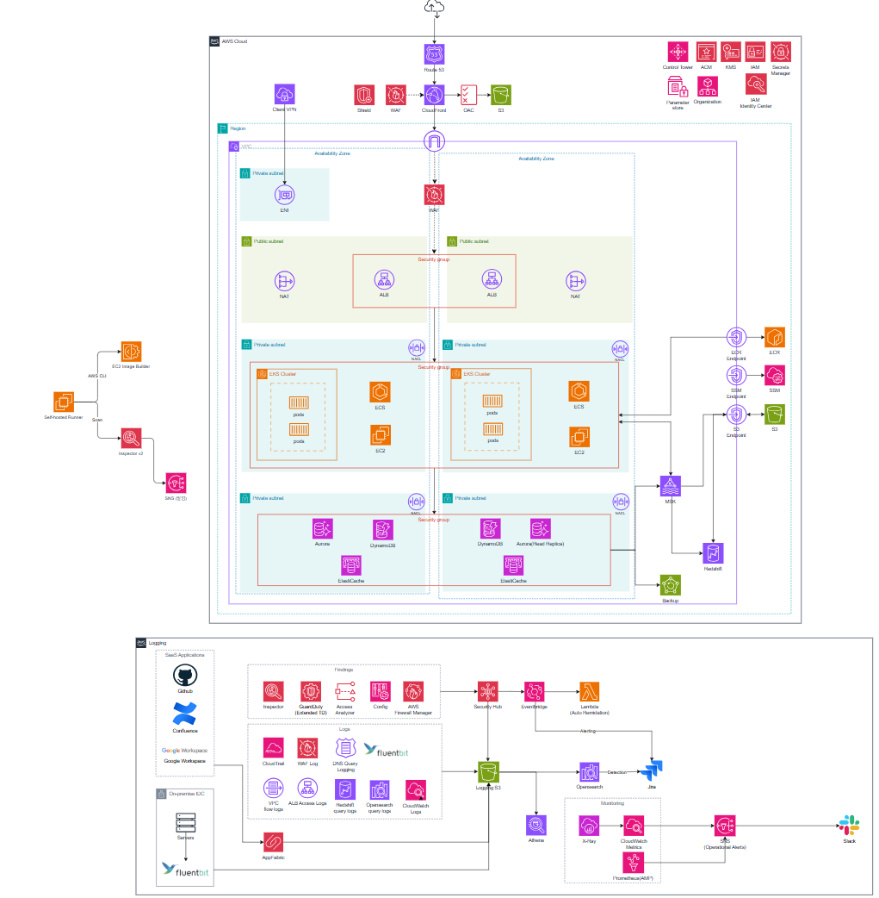
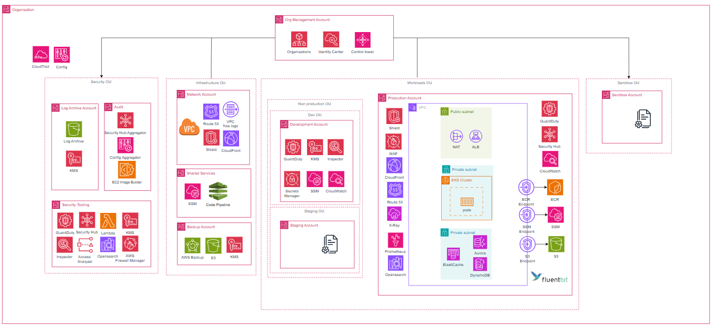

# 04 Scale — Enterprise

> [!IMPORTANT]
> 이 아키텍처는 대규모 조직(임직원 300명 이상)이 AWS Organizations 기반 멀티어카운트 환경을 운영하는 시나리오를 기반으로 설계된 엔터프라이즈 클라우드 아키텍처입니다. 


[](https://aws.amazon.com)

---

## 소개




<br>

- AWS Organizations 기반 12개 계정, 4단계 OU 계층으로 폭발 반경(Blast Radius)을 계정 경계로 격리
- Security OU(Log Archive·Audit·Security Tooling), Infrastructure OU(Network·SharedServices·Backup)를 전담 계정으로 분리
- SCP 9종(Foundation·Security·Infrastructure·Production·Staging·Development·Sandbox·Network·Backup·SharedServices)으로 OU 및 계정별 세분화된 가드레일 적용
- IAM Identity Center 6개 페르소나(인프라·보안·개발자·데이터 엔지니어·SRE·감사), 15개 Permission Set으로 최소 권한 접근 통제
- GuardDuty·SecurityHub·Inspector·Config·AccessAnalyzer·FirewallManager 6개 보안 서비스를 Security Tooling 계정으로 위임 관리

설계 의도와 위협 시나리오, 보안 설계 원칙 등 자세한 내용은 저희의 [GitHub Pages 문서](https://unitelivedispersedie.github.io/secure-cloud-architecture-docs/)를 참고해주세요.

---

## OU 계층 구조

```text
Root
├── Security OU
│   ├── Log Archive 계정      (CloudTrail·Config 로그 중앙 보관)
│   ├── Audit 계정            (AWS Audit Manager, 감사 전담)
│   └── Security Tooling 계정 (GuardDuty·SecurityHub·Inspector 위임 관리자)
│
├── Infrastructure OU
│   ├── Network 계정          (VPC·Transit Gateway·Route 53 전담)
│   ├── Shared Services 계정  (ECR·AMI·SSM Parameter Store 전담)
│   └── Backup 계정           (AWS Backup 중앙 관리)
│
├── Workloads OU
│   ├── Production OU
│   │   └── Prod App 계정
│   └── Non-Production OU
│       ├── Development OU
│       │   └── Dev Team 계정
│       └── Staging OU
│           ├── Staging App 계정
│           └── Staging Data 계정
│
└── Sandbox OU
    └── Sandbox 계정
```

---

## 계정 구조


| Terraform 루트 | 담당 계정 | 주요 리소스 |
|---|---|---|
| `management-account/` | Org Management | Organizations, OU 구조, SCP, IAM Identity Center, Permission Sets, 계정 할당 |

> [!NOTE]
> 각 멤버 계정(Security·Infrastructure·Workloads·Sandbox)의 워크로드 Terraform은 이 저장소의 범위에 포함되지 않습니다.  
> `management-account/`는 **조직 전체의 거버넌스 레이어**만 담당합니다.

---

## 모듈 구성

### `management-account/`

| 모듈 | 역할 |
|------|------|
| `organizations` | OU 계층 구조 생성, SCP 9종 작성 및 연결, 보안 서비스 위임 관리자 지정 |
| `identity_center` | 15개 Permission Set, 6개 그룹, 전 계정 할당(Account Assignment) |

---

### `organizations` 모듈 상세

#### OU 구조
| 리소스 | 설명 |
|--------|------|
| `Security` OU | Log Archive·Audit·Security Tooling 계정 수용 |
| `Infrastructure` OU | Network·SharedServices·Backup 계정 수용 |
| `Workloads` OU | Production·Non-Production 하위 OU 수용 |
| `Production` OU | Prod App 계정 수용 |
| `Non-Production` OU | Development·Staging 하위 OU 수용 |
| `Development` OU | Dev Team 계정 수용 |
| `Staging` OU | Staging App·Staging Data 계정 수용 |
| `Sandbox` OU | Sandbox 계정 수용 |

#### SCP 목록
| SCP | 적용 대상 | 주요 통제 |
|-----|-----------|-----------|
| Foundation | Root (전 계정) | Root 사용 차단, 리전 제한, CloudTrail 보호, IAM User/Access Key 생성 금지, S3 버킷 소유자 강제, EBS 암호화 강제 |
| Security OU | Security OU | Log Archive S3 보호, 보안 서비스 비활성화 금지, 워크로드 리소스 생성 금지 |
| Infrastructure OU | Infrastructure OU | 콘솔 직접 변경 금지 (TerraformExecutionRole 예외) |
| Network Account | Network 계정 | 네트워크 서비스 외 API 차단 (NotAction 패턴) |
| Backup Account | Backup 계정 | Backup Vault 삭제 금지, 외부 계정 백업 쓰기 금지 |
| SharedServices Account | SharedServices 계정 | 직접 워크로드 배포 금지 (AppCICDRole 예외) |
| Production OU | Production OU | 암호화 강제, IMDSv2 강제, 삭제 보호, 태그 강제, Flow Logs 보호, IGW 생성 금지, ECR Public 금지, SecretsManager 보호 |
| Staging OU | Staging OU | DB 삭제 보호 |
| Development OU | Development OU | 고비용 인스턴스 금지, RI 구매 금지, 고비용 서비스 금지, Production 계정 접근 금지 |
| Sandbox OU | Sandbox OU | 고비용 인스턴스 금지, TGW 연결 금지, VPC Peering 금지, RAM 공유 금지, RI 구매 금지 |

#### 위임 관리자
| 서비스 | 위임 계정 |
|--------|-----------|
| GuardDuty | Security Tooling |
| Inspector | Security Tooling |
| AWS Config | Security Tooling |
| IAM Access Analyzer | Security Tooling |
| SecurityHub | Security Tooling |
| Firewall Manager | Security Tooling |

---

### `identity_center` 모듈 상세

#### Permission Set 목록
| Permission Set | 대상 페르소나 | 기반 정책 | 주요 제한 (Inline Deny) |
|----------------|--------------|-----------|------------------------|
| `InfraAdmin` | 인프라 담당자 | AdministratorAccess | - |
| `InfraReadOnly` | 인프라 담당자 | ReadOnlyAccess | - |
| `SecurityToolingAdmin` | 보안 담당자 | AdministratorAccess | MFA 미적용 시 전체 차단, 키 삭제·IAM User 생성 금지 |
| `SecurityLogArchive` | 보안 담당자 | - (커스텀) | Athena 경유만 허용, S3 직접 접근 차단 |
| `SecurityReadOnly` | 보안 담당자 | ReadOnlyAccess | - |
| `SecurityAudit` | 보안 담당자 | SecurityAudit (AWS 관리형) | - |
| `DeveloperPowerUser` | 개발자 | PowerUserAccess | - |
| `DeveloperSandboxAdmin` | 개발자 | AdministratorAccess | - |
| `DeveloperStagingReadOnly` | 개발자 | ReadOnlyAccess | - |
| `DataEngineerProd` | 데이터 엔지니어 | - (커스텀) | S3·Athena·Glue·Redshift·MSK ReadOnly |
| `DataEngineerStaging` | 데이터 엔지니어 | - (커스텀) | S3·Redshift·MSK 읽기/쓰기 |
| `DataEngineerDev` | 데이터 엔지니어 | - (커스텀) | 데이터 서비스 전체 허용 |
| `DataEngineerSandbox` | 데이터 엔지니어 | PowerUserAccess | - |
| `SREAccess` | SRE / On-call | - (커스텀) | CloudWatch·SSM·ECS·RDS·ElastiCache 읽기 + SSM Session |
| `AuditorAccess` | Auditor | SecurityAudit + Config:Get/List | - |

#### 그룹 → 계정 할당 매트릭스

| 그룹 | Security OU | Infrastructure OU | Production | Staging | Dev | Sandbox |
|------|-------------|-------------------|------------|---------|-----|---------|
| infra-team | ReadOnly | **Admin** | ReadOnly | ReadOnly | **Admin** | **Admin** |
| security-team | 계정별 상이* | ReadOnly (Network) | SecurityAudit | SecurityAudit | SecurityAudit | - |
| developer-team | - | - | - | ReadOnly | PowerUser | **Admin** |
| data-engineer-team | - | - | 커스텀 ReadOnly | 커스텀 R/W | 전체 허용 | PowerUser |
| sre-team | SecurityTooling | Network | **SRE 커스텀** | **SRE 커스텀** | **SRE 커스텀** | - |
| auditor-team | **전체 계정** | **전체 계정** | **전체 계정** | **전체 계정** | **전체 계정** | - |

> \* Security 팀: Management·Audit 계정 ReadOnly, Log Archive 계정 LogArchive(Athena 경유), Security Tooling 계정 Admin

---

## Requirements

- Terraform >= 1.5.0
- AWS CLI >= 2.0 (configured)
- Management Account 자격증명

---

## 사전 조건

`terraform apply` 전에 아래 항목을 **반드시** 수동으로 완료해야 합니다.

> [!WARNING]
> 이 단계를 건너뛰면 `data "aws_organizations_organization"` 및 `data "aws_ssoadmin_instances"` data source가 빈 값을 반환하여 plan 단계에서 실패합니다.

1. **AWS Organizations 활성화**
   ```bash
   aws organizations create-organization --feature-set ALL
   ```

2. **IAM Identity Center 활성화**
   - AWS 콘솔 → IAM Identity Center → **ap-northeast-2** 리전에서 Enable

3. **멤버 계정 생성**
   - AWS 콘솔 → Organizations → Accounts → Add an AWS account
   - 11개 멤버 계정 각각에 고유한 이메일 주소 필요
   - 생성 후 각 계정의 12자리 Account ID를 `terraform.tfvars`에 입력

---

## 적용 순서

```bash
# Management Account 자격증명으로 실행
cd 04-scale-enterprise/management-account

cp terraform.tfvars.example terraform.tfvars
# terraform.tfvars에 실제 계정 ID 입력 후 저장

terraform init
terraform plan
terraform apply
```

---

## tfvars 작성 가이드

`terraform.tfvars.example`을 복사해 아래 항목을 실제 값으로 채웁니다.

```hcl
region = "ap-northeast-2"

# AWS Organizations → 우측 상단 Organization ID
org_id = "o-xxxxxxxxxx"

# 허용 리전 (글로벌 서비스는 리전 무관하게 허용)
allowed_regions = ["ap-northeast-2", "us-east-1"]

# ─── Security OU ──────────────────────────────────────────────────────────────
log_archive_account_id      = "111111111111"
audit_account_id            = "222222222222"
security_tooling_account_id = "333333333333"

# ─── Infrastructure OU ────────────────────────────────────────────────────────
network_account_id         = "444444444444"
shared_services_account_id = "555555555555"
backup_account_id          = "666666666666"

# ─── Production OU ────────────────────────────────────────────────────────────
prod_app_account_id = "777777777777"

# ─── Non-Production OU ────────────────────────────────────────────────────────
staging_app_account_id  = "888888888881"
staging_data_account_id = "888888888882"
dev_team_account_id     = "999999999999"

# ─── Sandbox OU ───────────────────────────────────────────────────────────────
sandbox_account_id = "000000000000"
```

> 각 계정 ID는 AWS 콘솔 → Organizations → Accounts 목록에서 확인할 수 있습니다.

---

## 배포 후 체크리스트

- [ ] OU 계층 구조 8개 정상 생성 확인 (Organizations 콘솔)
- [ ] SCP 10종 각 OU·계정에 올바르게 연결 확인
- [ ] Security Tooling 계정에 6개 보안 서비스 위임 관리자 지정 확인
- [ ] IAM Identity Center에 15개 Permission Set 생성 확인
- [ ] 6개 그룹(infra·security·developer·data-engineer·sre·auditor) 생성 확인
- [ ] 각 그룹별 계정 할당(Account Assignment) 정상 연결 확인
- [ ] 페르소나별 콘솔 로그인 및 권한 테스트 (특히 SecurityToolingAdmin MFA 강제 확인)
- [ ] Auditor 그룹이 전 계정에 ReadOnly로 접근 가능한지 확인

---

## 제거

> [!WARNING]
> `aws_organizations_account` 리소스가 포함된 경우 destroy 시 실제 AWS 멤버 계정이 삭제됩니다.  
> 계정 삭제는 되돌릴 수 없으므로 반드시 확인 후 진행하세요.

```bash
cd 04-scale-enterprise/management-account
terraform destroy
```

> IAM Identity Center의 Permission Set은 Account Assignment이 먼저 제거된 후 삭제됩니다. Terraform이 의존성 순서를 자동으로 처리합니다.
