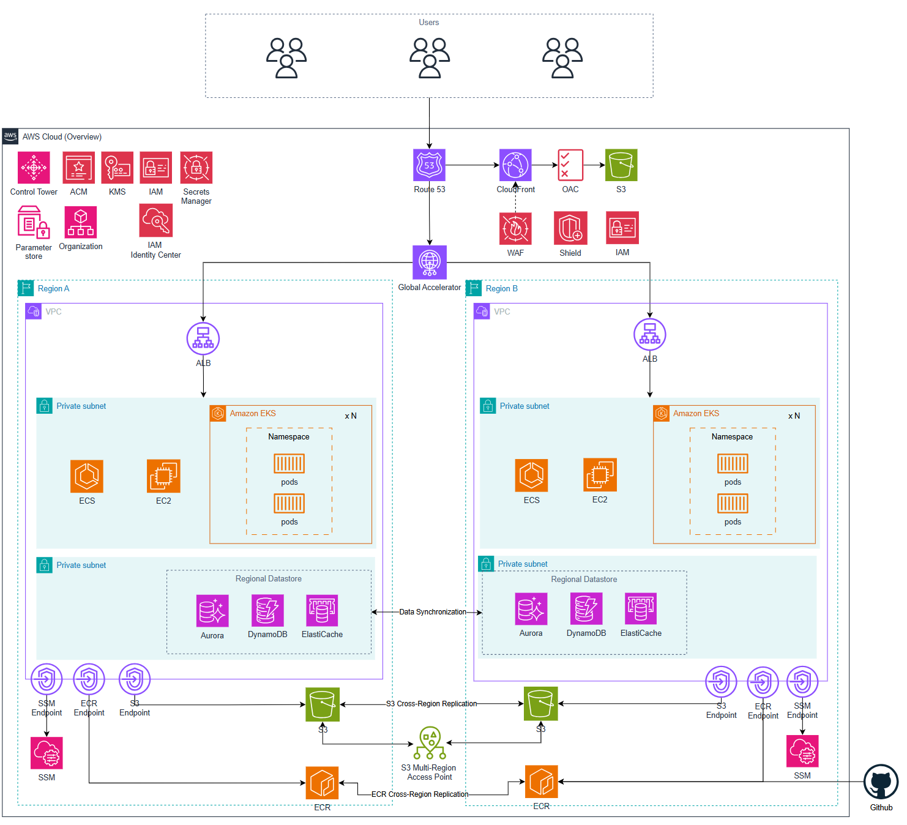

# 05 Scale — Hyperscale

> [!IMPORTANT]
> 이 아키텍처는 MAU 1,000만 규모의 서비스와 약 2,000명의 임직원(AWS 실접근 인원 약 200~250명)이 운영하는 환경을 기반으로 설계된 AWS 클라우드 아키텍처입니다.  
> 현재 저장소에서는 Terraform 구현 없이, 간략한 소개만 있습니다.

---

## 1. 소개

Hyperscale 단계는 단일 리전 또는 단일 조직 단위의 확장을 넘어, 글로벌 서비스 운영을 위한 아키텍처를 다루는 단계입니다.
이 단계에서는 단순히 리소스 수를 늘리는 것이 아니라, 여러 리전과 여러 계정, 대규모 배포 파이프라인, 중앙 보안 거버넌스, 장애 격리, 비용 최적화, 글로벌 관찰성을 함께 고려하는 구조가 필요합니다.
이 단계는 아래와 같은 큰 방향을 중심으로 정리합니다.

- 글로벌 규모의 서비스 운영 방식
- 여러 리전 또는 여러 계정을 고려한 확장 구조
- 리전별 컴플라이언스 대응 준비 
- Lambda 및 Opensearch 구조에서 보안, 로깅, 모니터링의 상용화
- 대규모 운영 조직에서 필요한 자동화와 관리 기준

---

## 2. 구현

> [!NOTE]
> 현재 이 단계에서는 Hyperscale 전체 아키텍처를 완성된 Terraform 코드로 제공하지 않습니다.
> 다만 이전 단계에서 다룬 멀티어카운트, 로깅, 보안 거버넌스 개념을 더 큰 규모로 확장할 수 있도록 아래와 같은 영역을 고려 대상으로 둡니다.

| 영역 | 방향 |
|------|------|
| 글로벌 운영 | 여러 지역과 사용자를 고려한 운영 구조를 검토 |
| 확장 구조 | 계정, 리전, 워크로드를 규모에 맞게 분리하는 방향을 검토 |
| 장애 대응 | 장애 범위를 줄이고 복구 절차를 표준화하는 방향을 검토 |
| 보안/거버넌스 | 중앙 보안 정책과 계정 단위 책임을 함께 가져가는 방향을 검토 |
| 관찰성 | 로그, 메트릭, 알림을 통합적으로 운영하는 방향을 검토 |
| 자동화 | 배포와 운영 변경을 반복 가능하게 만드는 방향을 검토 |

구체적인 Terraform 모듈 구성이나 배포 순서는 추후 작성 예정입니다.

---